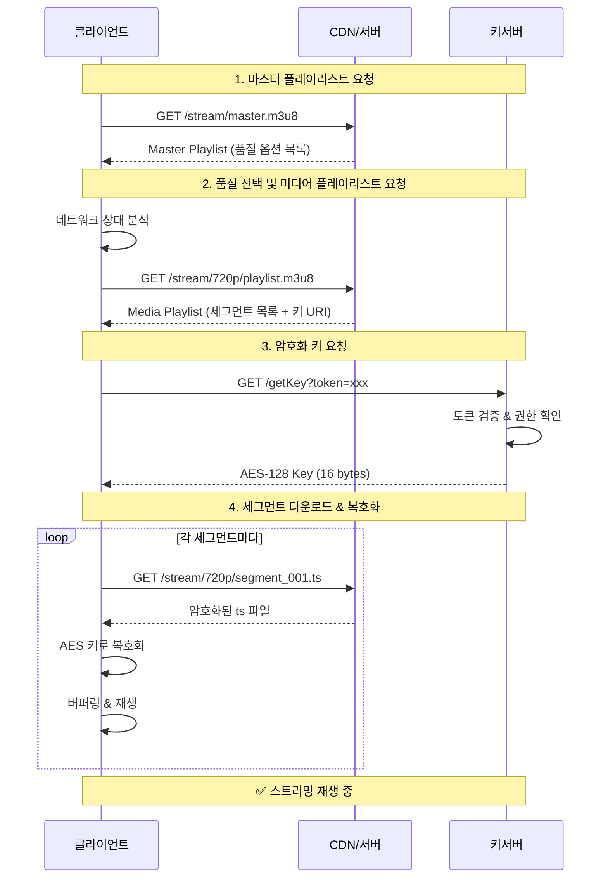

## 들어가며

음악 스트리밍 서비스를 개발하면서 가장 인상 깊었던 기술 중 하나가 바로 HLS(HTTP Live Streaming)입니다. 처음에는 단순히 "오디오/비디오를 스트리밍하는 방법" 정도로 생각했지만, 직접 구현해보니 그 안에는 정교한 보안 메커니즘과 효율적인 전송 철학이 담겨 있었습니다.

이 글에서는 HLS의 핵심 원리부터 실무에서 마주한 이슈들까지, 맨땅에 헤딩하며 배운 경험을 정리했습니다.

<div className="-mx-2 flex flex-wrap overflow-hidden xl:-mx-2">
  <div className="my-1 w-full overflow-hidden px-2 xl:my-1 xl:w-full xl:px-2">
    <Image
      alt="HLS Architecture Overview showing media server, m3u8 manifest, ts segments and client devices"
      src="/static/images/career/hls-architecture-overview.png"
      width={1200}
      height={630}
      className="w-full rounded-lg object-cover"
    />
    <div className="mt-2 text-center text-sm text-gray-500">
      HLS 아키텍처: 미디어 서버에서 클라이언트까지의 전체 흐름
    </div>
  </div>
</div>

## HLS란 무엇인가?

### 기본 개념

HLS(HTTP Live Streaming)는 Apple이 2009년에 개발한 적응형 비트레이트 스트리밍 프로토콜입니다. RFC 8216으로 표준화되어 있으며, 표준 HTTP 프로토콜을 기반으로 하기 때문에 방화벽과 프록시 서버를 쉽게 통과할 수 있습니다.

HLS의 핵심 특징:

- 📡 HTTP 기반: CDN과 기존 웹 인프라 활용 가능
- 🔄 적응형 스트리밍: 네트워크 상태에 따라 화질 자동 조절
- 🔒 암호화 지원: AES-128 암호화로 콘텐츠 보호
- 📱 크로스 플랫폼: iOS, Android, 웹 브라우저 모두 지원

### 왜 HLS인가?

전통적인 파일 다운로드 방식과 비교했을 때 HLS의 매력은 확실합니다:

| 구분          | 전통적 다운로드         | HLS 스트리밍        |
| ------------- | ----------------------- | ------------------- |
| 콘텐츠 접근   | 전체 파일 다운로드 필요 | 청크 단위 순차 요청 |
| 재생 시작     | 다운로드 완료 후        | 즉시 재생 가능      |
| 네트워크 적응 | 불가능                  | 자동 품질 조절      |
| 보안          | 파일 복사 가능          | 복제 매우 어려움    |
| 저장 공간     | 전체 파일 필요          | 버퍼 크기만 필요    |

### 누가 HLS를 사용하나요?

가장 대표적인 사례는 **Twitch**입니다. 트위치 방송을 보면서 개발자 도구 네트워크 탭을 열어보면, `.ts` 파일들이 끊임없이 쏟아지는 것을 볼 수 있습니다. 이는 HLS가 대규모 라이브 트래픽을 처리하는 데 얼마나 효과적인지 보여주는 "살아있는 교과서"입니다.

- **Twitch**: 초저지연 HLS(Low-Latency HLS)를 적극 도입하여 수십만 명이 동시에 보는 라이브 방송을 안정적으로 송출합니다.
- **Apple Music & TV+**: HLS를 만든 장본인답게, 고음질 음원과 4K HDR 영상을 모두 HLS로 전송합니다.
- **국내 스트리밍(치지직, 아프리카TV)**: 웹 플레이어 환경에서는 대부분 HLS(또는 LL-HLS)를 표준으로 채택하고 있습니다.

> 🤔 **스포티파이는요?**
> 많은 분들이 궁금해하시지만, 스포티파이는 HLS 대신 **독자적인 청크 전송 방식**(암호화된 Ogg/AAC 파일 분할 요청)을 사용합니다. 오디오 전용 서비스에 특화된 최적화를 위해 표준 프로토콜 대신 커스텀 방식을 택한 케이스입니다.

## m3u8: HLS의 핵심 매니페스트 파일

### m3u8 파일의 역할

m3u8은 HLS에서 가장 중요한 파일입니다. UTF-8로 인코딩된 M3U 플레이리스트 파일로, 스트리밍에 필요한 모든 메타데이터를 담고 있습니다.

> 💡 **m3u8 = m3u + UTF-8**  
> M3U(Multimedia Playlist)의 UTF-8 인코딩 버전을 의미합니다.

### 두 가지 유형의 m3u8

m3u8 파일은 역할에 따라 **두 가지 유형**으로 나뉩니다. 이 구조를 파악하는 것이 HLS 이해의 첫걸음입니다.

#### 1. Master Playlist (마스터 플레이리스트)

마스터 플레이리스트는 사용 가능한 모든 품질 옵션을 나열합니다. 클라이언트가 가장 먼저 요청하는 파일입니다.

```m3u8
#EXTM3U
#EXT-X-VERSION:4

#EXT-X-STREAM-INF:BANDWIDTH=800000,RESOLUTION=640x360,CODECS="avc1.4d401f,mp4a.40.2"
quality_360p/playlist.m3u8

#EXT-X-STREAM-INF:BANDWIDTH=1400000,RESOLUTION=1280x720,CODECS="avc1.4d401f,mp4a.40.2"
quality_720p/playlist.m3u8

#EXT-X-STREAM-INF:BANDWIDTH=2800000,RESOLUTION=1920x1080,CODECS="avc1.640028,mp4a.40.2"
quality_1080p/playlist.m3u8
```

**주요 태그 설명:**

- `#EXTM3U`: m3u8 파일임을 나타내는 헤더
- `#EXT-X-STREAM-INF`: 각 품질 변형(variant) 정보
- `BANDWIDTH`: 비트레이트 (bits per second)
- `RESOLUTION`: 비디오 해상도
- `CODECS`: 사용된 코덱 정보

#### 2. Media Playlist (미디어 플레이리스트)

미디어 플레이리스트는 실제 재생할 세그먼트 목록을 담고 있습니다. 마스터 플레이리스트에서 특정 품질을 선택하면 해당 미디어 플레이리스트를 요청합니다.

```m3u8
#EXTM3U
#EXT-X-VERSION:4
#EXT-X-TARGETDURATION:10
#EXT-X-MEDIA-SEQUENCE:0
#EXT-X-KEY:METHOD=AES-128,URI="https://key-server.example.com/key?track=audio",IV=0x1234567890ABCDEF

#EXTINF:10.0,
segment_001.ts
#EXTINF:10.0,
segment_002.ts
#EXTINF:10.0,
segment_003.ts
#EXTINF:8.5,
segment_004.ts

#EXT-X-ENDLIST
```

**주요 태그 설명:**

- `#EXT-X-TARGETDURATION`: 세그먼트 최대 길이 (초)
- `#EXT-X-MEDIA-SEQUENCE`: 첫 번째 세그먼트 번호
- `#EXT-X-KEY`: 암호화 키 정보 (가장 중요!)
- `#EXTINF`: 각 세그먼트의 재생 시간
- `#EXT-X-ENDLIST`: VOD 콘텐츠의 종료 표시

### m3u8 계층 구조 시각화

```
Master Playlist (index.m3u8)
├── 360p Media Playlist (quality_360p/playlist.m3u8)
│   ├── segment_001.ts
│   ├── segment_002.ts
│   └── ...
├── 720p Media Playlist (quality_720p/playlist.m3u8)
│   ├── segment_001.ts
│   ├── segment_002.ts
│   └── ...
└── 1080p Media Playlist (quality_1080p/playlist.m3u8)
    ├── segment_001.ts
    ├── segment_002.ts
    └── ...
```

## 미디어 세그먼트: 콘텐츠의 작은 조각들

### 세그먼트 형식

HLS는 미디어 콘텐츠를 작은 조각으로 분할하여 전송합니다. 주로 사용되는 형식은 두 가지입니다:

1. TS (MPEG-2 Transport Stream): 전통적이고 가장 널리 지원되는 형식
2. fMP4 (Fragmented MPEG-4): 최신 코덱과 저지연 기능에 최적화된 형식

왜 세그먼트 형식을 사용할까요?

1. 오류 복원력: 일부 데이터 손실에도 재생 가능
2. 동기화: 오디오/비디오 동기화 정보 포함
3. 스트리밍 최적화: 연속 재생에 최적화된 구조
4. 호환성: 다양한 코덱과 포맷 지원

### 세그먼트 분할의 장점

일반적으로 세그먼트는 2~10초 단위로 분할됩니다. 음악 스트리밍에서는 주로 10초를 사용합니다.

```
원본 파일 (3분 곡)
    ↓ 분할
18개의 ts 세그먼트 (각 10초)
```

세그먼트 분할의 이점:

- ⚡ 빠른 시작: 첫 세그먼트만 받으면 즉시 재생
- 🔄 품질 전환: 네트워크 상태에 따라 다음 세그먼트부터 품질 변경
- 🛡️ 보안: 전체 파일을 한 번에 얻을 수 없음
- 💾 효율성: 필요한 부분만 버퍼링

## 키서버와 암호화: 콘텐츠 보호의 핵심

<div className="-mx-2 flex flex-wrap overflow-hidden xl:-mx-2">
  <div className="my-1 w-full overflow-hidden px-2 xl:my-1 xl:w-full xl:px-2">
    <Image
      alt="Security comparison between traditional download and HLS streaming"
      src="/static/images/career/hls-security-comparison.png"
      width={1200}
      height={630}
      className="w-full rounded-lg object-cover"
    />
    <div className="mt-2 text-center text-sm text-gray-500">
      전통적 다운로드 vs HLS 스트리밍의 보안 비교
    </div>
  </div>
</div>

### 왜 암호화가 필요한가?

디지털 미디어 콘텐츠는 쉽게 복제될 수 있습니다. 스트리밍 서비스에서 콘텐츠 보호는 비즈니스의 핵심입니다. HLS는 AES-128 암호화를 통해 이 문제를 해결합니다.

### 키서버 인증 방식

m3u8 파일에 명시된 키서버를 통해 암호화 키를 받아오는 흐름:

```m3u8
#EXT-X-KEY:METHOD=AES-128,URI="https://keyserver.example.com/getKey?token=eyJhbGc...",IV=0x1234567890ABCDEF
```

**전체 재생 및 인증 흐름:**

1. **마스터/미디어 플레이리스트 요청**: 클라이언트가 스트림 정보를 파악하고 네트워크 상태에 맞춰 품질을 선택합니다.
2. **키 요청 (Key Request)**: 암호화된 콘텐츠를 풀기 위해, m3u8에 명시된 키서버로 인증 토큰과 함께 요청을 보냅니다.
3. **권한 검증 및 발급**: 키서버가 토큰을 검증하고, 유효한 경우 AES-128 키(16바이트)를 반환합니다.
4. **다운로드 및 복호화**: 클라이언트는 이 키를 사용해 암호화된 `.ts` 세그먼트를 실시간으로 해독하고 재생합니다.

<div className="-mx-2 flex flex-wrap overflow-hidden xl:-mx-2">
  <div className="my-1 w-full overflow-hidden px-2 xl:my-1 xl:w-full xl:px-2">
    <Image
      alt="HLS streaming sequence flow diagram"
      src="/static/images/career/hls-sequence-flow.png"
      width={1200}
      height={630}
      className="w-full rounded-lg object-cover"
    />
    <div className="mt-2 text-center text-sm text-gray-500">
      HLS 스트리밍의 전체 흐름: 요청부터 재생까지
    </div>
  </div>
</div>

<details>
<summary>시퀀스 다이어그램 코드 보기</summary>



</details>

### 보안적 장점: 다운로드가 원천적으로 불가능한 이유

HLS가 보안적으로 강력한 이유는 여러 겹의 보호 메커니즘 때문입니다:

#### 1. 세그먼트 기반 구조

```javascript
// 전통적 다운로드
downloadFile('song.mp3') // 전체 파일 획득 가능

// HLS 스트리밍
// segment_001.ts, segment_002.ts, ... 수십 개 파일
// + 암호화되어 있음
// + 키가 없으면 무용지물
```

- 전체 콘텐츠가 하나의 파일이 아닌 수십~수백 개의 조각
- 각 세그먼트를 모두 수집해도 암호화된 상태
- 세그먼트 파일명이 동적으로 변경 가능

#### 2. 키 보호

```javascript
// 키서버 요청 예시
const keyResponse = await fetch('https://keyserver.example.com/getKey', {
  headers: {
    Authorization: `Bearer ${userToken}`,
    'X-Device-ID': deviceId,
    'X-Session-ID': sessionId,
  },
})
```

- 키는 인증된 사용자에게만 발급
- 요청마다 토큰 검증
- 기기 인증, 세션 관리 등 추가 보안 적용 가능
- 키에 만료 시간 설정 가능

#### 3. 시간 기반 토큰

```javascript
// URL에 시간 기반 토큰 추가
const signedUrl = `https://cdn.example.com/segment.ts?token=${generateToken(userId, expiresAt)}`
```

- URL이 시간 제한 있음
- 같은 URL을 나중에 사용하면 만료됨

### 보안과 Latency의 균형

완벽한 보안은 없지만, HLS는 실용적인 보안 수준을 제공합니다:

```
보안 수준 ↑                    지연시간 ↓
──────────────────────────────────────────
Strong DRM (Widevine, FairPlay)    ← 가장 안전, 구현 복잡
HLS + AES-128 + Token Auth         ← 실무에서 많이 사용
HLS + AES-128                      ← 기본적 보호
Plain HLS                          ← 보안 없음
```

## 클라이언트 구현과 라이브러리

웹에서 HLS를 재생하기 위해 사용할 수 있는 주요 라이브러리들입니다:

### 1. 주요 라이브러리 비교

- **hls.js**: 가장 널리 사용되는 가벼운 라이브러리입니다. HLS 전용이며 커스터마이징이 쉽습니다. (넷플릭스, 트위치 등에서 사용 이력 있음)
- **Video.js**: 강력한 UI와 플러그인 생태계를 가진 전통의 강자입니다. 내부적으로 hls.js를 엔진으로 사용할 수도 있습니다.
- **Shaka Player**: 구글이 만든 라이브러리로, HLS뿐만 아니라 DASH도 지원합니다. 오프라인 저장 기능과 멀티 DRM 처리에 강점이 있습니다.

보편적인 음악/영상 서비스라면 **hls.js**가 가장 합리적인 선택입니다.

### 2. hls.js 구현 예시

hls.js는 JavaScript로 구현된 HLS 클라이언트 라이브러리입니다.

### 브라우저 재생 원리와 트랜스머싱(Transmuxing)

Safari를 제외한 대부분의 브라우저는 HLS의 기본 컨테이너인 `.ts`(MPEG-2 TS) 파일을 직접 재생할 수 없습니다. 이를 브라우저에서 재생하기 위해 **트랜스머싱(Transmuxing)** 기술이 사용됩니다.

1. `.ts` 세그먼트(MPEG-2 TS) 다운로드
2. 브라우저가 이해할 수 있는 `mp4`(ISOBMFF) 포맷으로 실시간 변환
3. 변환된 데이터를 MSE(Media Source Extensions)를 통해 `<video>` 태그에 주입

`hls.js` 라이브러리는 이 복잡한 변환 과정을 브라우저상에서 효율적으로 처리해줍니다.

```bash
npm install hls.js
```

### 기본 구현

```typescript
import Hls from 'hls.js'

function initHlsPlayer(videoElement: HTMLVideoElement, streamUrl: string) {
  // 1. iOS Safari 등 네이티브 지원 브라우저 처리
  // 중요: iOS Safari는 MSE를 통한 HLS를 지원하지 않으므로 hls.js 사용 불가
  if (videoElement.canPlayType('application/vnd.apple.mpegurl')) {
    videoElement.src = streamUrl
    videoElement.play()
    return
  }

  // hls.js 지원 여부 확인
  if (!Hls.isSupported()) {
    console.error('HLS is not supported in this browser')
    return
  }

  const hls = new Hls({
    debug: false,
    enableWorker: true,
    lowLatencyMode: true,
  })

  hls.loadSource(streamUrl)
  hls.attachMedia(videoElement)

  hls.on(Hls.Events.MANIFEST_PARSED, () => {
    console.log('Manifest loaded, starting playback')
    videoElement.play()
  })

  hls.on(Hls.Events.ERROR, (event, data) => {
    if (data.fatal) {
      switch (data.type) {
        case Hls.ErrorTypes.NETWORK_ERROR:
          console.error('Network error, trying to recover...')
          hls.startLoad()
          break
        case Hls.ErrorTypes.MEDIA_ERROR:
          console.error('Media error, trying to recover...')
          hls.recoverMediaError()
          break
        default:
          console.error('Fatal error, cannot recover')
          hls.destroy()
          break
      }
    }
  })

  return hls
}
```

### 커스텀 키 로더 구현

키서버와의 통신을 커스터마이징해야 할 때:

```typescript
import Hls from 'hls.js'

const hls = new Hls({
  // 커스텀 XHR 설정
  xhrSetup: (xhr: XMLHttpRequest, url: string) => {
    // 키서버 요청에 인증 헤더 추가
    if (url.includes('keyserver')) {
      xhr.setRequestHeader('Authorization', `Bearer ${getAccessToken()}`)
      xhr.setRequestHeader('X-Device-ID', getDeviceId())
    }
  },

  // 또는 fetch 기반 로더 사용
  loader: class CustomLoader extends Hls.DefaultConfig.loader {
    load(context: any, config: any, callbacks: any) {
      const { url, type } = context

      if (type === 'key') {
        // 키 요청 커스터마이징
        fetch(url, {
          headers: {
            Authorization: `Bearer ${getAccessToken()}`,
          },
        })
          .then((response) => response.arrayBuffer())
          .then((data) => {
            callbacks.onSuccess({ data }, { url }, context)
          })
          .catch((error) => {
            callbacks.onError({ code: 0, text: error.message }, context, null)
          })
      } else {
        // 일반 요청은 기본 로더 사용
        super.load(context, config, callbacks)
      }
    }
  },
})
```

### 적응형 비트레이트 제어

네트워크 상태에 따라 품질을 동적으로 조절:

```typescript
const hls = new Hls({
  // ABR(Adaptive Bitrate) 설정
  abrController: Hls.DefaultConfig.abrController,
  abrEwmaDefaultEstimate: 500000, // 초기 대역폭 추정 (500 kbps)
  abrBandWidthFactor: 0.95, // 대역폭 사용률
  abrBandWidthUpFactor: 0.7, // 품질 상향 시 대역폭 요구량

  // 버퍼 설정
  maxBufferLength: 30, // 최대 버퍼 길이 (초)
  maxBufferSize: 60 * 1000 * 1000, // 최대 버퍼 크기 (60MB)
  maxBufferHole: 0.5, // 버퍼 홀 허용치 (초)
})

// 이벤트를 통한 품질 모니터링
hls.on(Hls.Events.LEVEL_SWITCHED, (event, data) => {
  console.log(`품질 변경: Level ${data.level}`)
  const level = hls.levels[data.level]
  console.log(`해상도: ${level.width}x${level.height}`)
  console.log(`비트레이트: ${(level.bitrate / 1000).toFixed(0)} kbps`)
})

// 수동 품질 선택 (자동 ABR 비활성화)
function setQuality(levelIndex: number) {
  hls.currentLevel = levelIndex // -1이면 자동
}
```

### React 컴포넌트 예시

```tsx
import { useEffect, useRef, useState } from 'react'
import Hls from 'hls.js'

interface HlsPlayerProps {
  src: string
  autoPlay?: boolean
  onReady?: () => void
  onError?: (error: string) => void
}

export function HlsPlayer({ src, autoPlay = false, onReady, onError }: HlsPlayerProps) {
  const videoRef = useRef<HTMLVideoElement>(null)
  const hlsRef = useRef<Hls | null>(null)
  const [currentQuality, setCurrentQuality] = useState<string>('Auto')

  useEffect(() => {
    const video = videoRef.current
    if (!video) return

    // Safari는 네이티브 HLS 지원
    if (video.canPlayType('application/vnd.apple.mpegurl')) {
      video.src = src
      onReady?.()
      return
    }

    if (!Hls.isSupported()) {
      onError?.('HLS is not supported')
      return
    }

    const hls = new Hls({
      enableWorker: true,
      lowLatencyMode: true,
    })

    hlsRef.current = hls

    hls.loadSource(src)
    hls.attachMedia(video)

    hls.on(Hls.Events.MANIFEST_PARSED, () => {
      onReady?.()
      if (autoPlay) {
        video.play().catch(console.error)
      }
    })

    hls.on(Hls.Events.LEVEL_SWITCHED, (_, data) => {
      const level = hls.levels[data.level]
      setCurrentQuality(`${level.height}p`)
    })

    hls.on(Hls.Events.ERROR, (_, data) => {
      if (data.fatal) {
        onError?.(data.type)
      }
    })

    return () => {
      hls.destroy()
    }
  }, [src, autoPlay, onReady, onError])

  return (
    <div className="relative">
      <video ref={videoRef} controls className="w-full rounded-lg" playsInline />
      <div className="absolute right-4 bottom-16 rounded bg-black/70 px-2 py-1 text-sm text-white">
        {currentQuality}
      </div>
    </div>
  )
}
```

## 실무 디버깅 및 트러블슈팅 가이드

HLS 재생에 문제가 생겼을 때, 원인은 클라이언트 코드, 네트워크, 혹은 인코딩된 소스 파일 자체에 있을 수 있습니다. 다음은 현업에서 사용하는 단계별 디버깅 접근법입니다.

### 1. 이슈 분리하기 (Isolation)

가장 먼저 해야 할 일은 "내 프론트엔드 코드의 문제인가, 아니면 스트림 URL 자체의 문제인가?"를 판단하는 것입니다.

- **hls.js 데모 페이지 활용**: [hls.js 데모 페이지](https://hls-js.netlify.app/demo/)에 문제가 되는 m3u8 URL을 넣어보세요.
  - **거기서도 안 된다**: 스트림 소스(인코딩, CDN, 키서버) 문제 → 백엔드/미디어 팀에 리포트
  - **거기서는 잘 된다**: 내 프론트엔드 코드(설정, 라이프사이클 관리) 문제

### 2. 주요 에러 증상별 체크리스트

#### 🛑 무한 로딩 (Infinite Loading)

- **증상**: 스피너만 돌고 영상이 시작되지 않음.
- **체크 포인트**:
  - **CORS**: 개발자 도구 Console에 빨간색 CORS 에러가 있는지 확인합니다. m3u8뿐만 아니라 `.ts` 파일, `키서버` 도메인 모두 허용되어야 합니다.

    ```nginx
    # Nginx CORS 설정 예시 (Production Level)
    location /hls/ {
        # Preflight 요청 처리
        if ($request_method = 'OPTIONS') {
            add_header 'Access-Control-Allow-Origin' '*';
            add_header 'Access-Control-Allow-Methods' 'GET, OPTIONS';
            add_header 'Access-Control-Allow-Headers' 'Authorization, Content-Type';
            add_header 'Access-Control-Max-Age' 1728000;
            add_header 'Content-Type' 'text/plain; charset=utf-8';
            add_header 'Content-Length' 0;
            return 204;
        }

        # 실제 요청 처리
        add_header 'Access-Control-Allow-Origin' '*' always;
        add_header 'Access-Control-Allow-Methods' 'GET, OPTIONS' always;
        add_header 'Access-Control-Allow-Headers' 'Authorization, Content-Type' always;
        add_header 'Access-Control-Expose-Headers' 'Content-Length' always;
    }
    ```

  - **Mixed Content**: HTTPS 페이지에서 HTTP 스트림을 요청하면 차단됩니다.

#### ⏸️ 재생 중 멈춤 (Stalling)

- **증상**: 잘 나오다가 특정 구간에서 멈추거나 버퍼링이 걸림.
- **체크 포인트**:
  - **Gap**: `.ts` 세그먼트 번호가 건너뛰어지거나 누락되었는지 확인합니다.
  - **PTS(Presentation Time Stamp)**: 오디오와 비디오의 타임스탬프가 어긋나면 `hls.js`가 싱크를 맞추기 위해 멈출 수 있습니다.
  - **Discontinuity**: 광고 삽입 등으로 스트림 속성이 변할 때 `#EXT-X-DISCONTINUITY` 태그가 정확히 없으면 멈춥니다.

#### 📱 PC에선 되는데 iOS에서만 안 됨

- **증상**: 크롬/파이어폭스 잘 됨, 아이폰/맥 사파리에서 안 됨.
- **원인**: iOS는 네이티브 플레이어를 사용하며, 스펙 준수에 매우 엄격합니다.
- **체크 포인트**:
  - **코덱 프로파일**: iOS 구형 기기는 High Profile을 지원하지 않을 수 있습니다. (Main Profile 권장)
  - **프레임 레이트**: 가변 프레임 레이트보다는 고정 프레임 레이트를 권장합니다.
  - **해결**: Mac이 있다면 `mediastreamvalidator` 도구로 스트림 규격 위반을 검사해봐야 합니다.

### 3. hls.js 정교한 에러 핸들링

단순 로깅을 넘어, 에러 타입에 따라 사용자에게 적절한 피드백을 주거나 자동 복구를 시도해야 합니다.

```typescript
hls.on(Hls.Events.ERROR, (event, data) => {
  if (data.fatal) {
    switch (data.type) {
      case Hls.ErrorTypes.NETWORK_ERROR:
        // 인터넷 연결 문제 등 -> 재시도 로직
        console.log('네트워크 에러, 스트림 로드 재시도...')
        hls.startLoad()
        break
      case Hls.ErrorTypes.MEDIA_ERROR:
        // 깨진 세그먼트 등 -> 해당 구간 건너뛰기 시도
        console.log('미디어 에러, 자동 복구 시도...')
        hls.recoverMediaError()
        break
      default:
        // 복구 불가능한 에러 -> 플레이어 파괴 및 사용자 알림
        console.error('복구 불가능한 치명적 에러')
        hls.destroy()
        // 사용자에게 "재생할 수 없습니다" UI 표시
        break
    }
  } else {
    // Non-fatal 에러 (일시적 버퍼 부족 등) -> 로그만 남김
    console.warn('Non-fatal error:', data.details)
  }
})
```

### 4. 네트워크 요청 패턴 분석

정상적인 HLS 스트리밍 중에는 개발자 도구 Network 탭에서 다음과 같은 리듬이 보여야 합니다:

1. **playlist.m3u8**: 주기적으로 200 OK (라이브의 경우)
2. **segment_xxx.ts**: 세그먼트 길이(예: 10초)마다 규칙적으로 다운로드
   - ⚠️ **주의**: 다운로드 시간이 세그먼트 재생 시간보다 길어지면 버퍼링이 발생합니다 (네트워크 대역폭 부족).
3. **Key 요청**: 암호화된 세그먼트 재생 직전에 수행

### 5. 키 관리 주의사항 (Key Rotation)

보안을 위해 키를 자주 교체(Rotation)하는 경우, 클라이언트가 이전 키를 캐싱하고 있으면 재생 실패가 발생합니다.

- **해결**: 키 요청 API 응답 헤더에 `Cache-Control: no-cache, no-store`를 반드시 명시해야 합니다.
- **클라이언트 측**: `hls.js` 설정에서 키 요청 시 헤더를 강제하거나, 랜덤 쿼리 파라미터를 붙일 수 있습니다.

```typescript
// 클라이언트 측 캐시 방지 설정 예시
const hls = new Hls({
  xhrSetup: (xhr, url) => {
    if (url.includes('keyserver')) {
      xhr.setRequestHeader('Cache-Control', 'no-cache')
    }
  },
})
```

## 성능 최적화

### 버퍼링 최적화 전략

```typescript
const hls = new Hls({
  // 초기 버퍼링 최소화 (빠른 시작)
  maxBufferLength: 10,
  maxMaxBufferLength: 30,

  // Low Latency 모드
  lowLatencyMode: true,
  liveSyncDuration: 3,
  liveMaxLatencyDuration: 10,

  // 세그먼트 prefetch
  maxBufferHole: 0.5,
})
```

### CDN 활용

```
사용자 요청
    ↓
엣지 서버 (가까운 위치)
    ↓ (캐시 miss 시)
오리진 서버
```

- 세그먼트 파일은 CDN 캐싱 적극 활용
- 키서버는 오리진 직접 요청 (보안)
- m3u8은 짧은 TTL로 캐싱

## 마치며

처음 HLS를 도입할 때는 단순히 `.mp4` 파일을 잘게 쪼개서 보내는 것이라고만 생각했습니다. 하지만 깊게 파고들수록 서버와 클라이언트, 그리고 보안이 맞물려 돌아가는 거대한 시스템이라는 것을 알게 되었습니다.

특히 "어떻게 하면 유저에게 끊김 없는 경험을 주면서도, 콘텐츠를 안전하게 보호할까?"라는 모순적인 고민을 우아하게 해결한 프로토콜이라고 생각합니다. 만약 여러분이 미디어 서비스를 준비 중이라면, 다소 복잡해 보이는 HLS가 결국엔 가장 든든한 기반이 되어줄 것입니다.

## 참고 자료

- [Apple HLS Authoring Specification](https://developer.apple.com/documentation/http-live-streaming/hls-authoring-specification-for-apple-devices)
- [hls.js GitHub Repository](https://github.com/video-dev/hls.js)
- [RFC 8216 - HTTP Live Streaming](https://datatracker.ietf.org/doc/html/rfc8216)
- [MDN - Media Source Extensions](https://developer.mozilla.org/en-US/docs/Web/API/Media_Source_Extensions_API)
