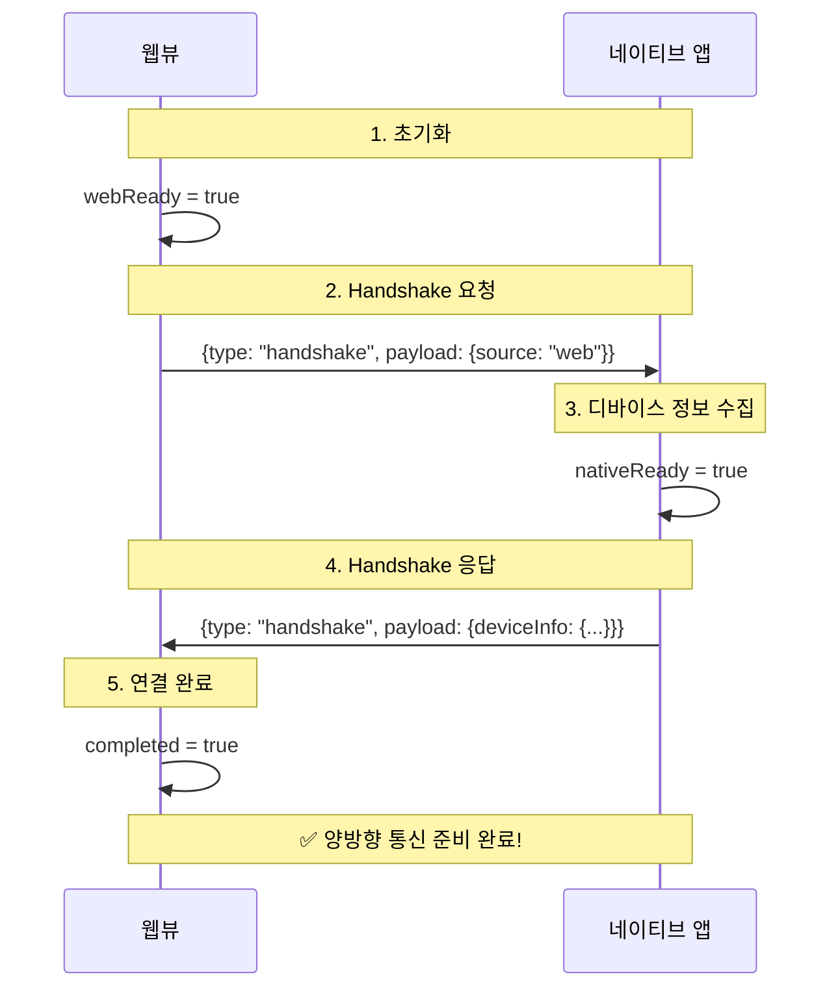

## 들어가며

이제 막 웹뷰 관련 업무를 맡게 되셨나요? 아마 이런 상황이실 겁니다:

- 📱 앱 개발자가 "웹뷰로 이 화면 좀 만들어주세요"라고 요청
- 💬 기획팀에서 "앱과 웹 간에 데이터 주고받아야 해요"라고 전달
- 🤔 "웹뷰가 뭐지? 어떻게 앱이랑 통신하지?"

걱정하지 마세요. 이 글은 웹뷰를 처음 접하는 분들을 위해 작성되었습니다. 복잡한 전문 용어 없이, 시각적 자료와 함께 단계별로 설명해드리겠습니다.

<div className="-mx-2 flex flex-wrap overflow-hidden xl:-mx-2">
  <div className="my-1 w-full overflow-hidden px-2 xl:my-1 xl:w-full xl:px-2">
    <Image
      alt="Junior developer collaborating with team on webview architecture"
      src="/static/images/career/webview-collaboration-team.png"
      width={1200}
      height={630}
      className="w-full rounded-lg object-cover"
    />
    <div className="mt-2 text-center text-sm text-gray-500">
      웹뷰 작업은 다양한 팀과의 협업이 필수입니다. 이 글을 통해 자신감 있게 소통할 수 있게 됩니다!
    </div>
  </div>
</div>

## 웹뷰(WebView)란 무엇인가?

### 웹뷰의 기본 개념

웹뷰는 네이티브 앱&lpar;iOS/Android&rpar; 안에서 웹페이지를 보여주는 일종의 "내장 브라우저"입니다.

일반 웹사이트와 다른 점은:

- 🌐 **일반 웹**: 크롬, 사파리 등 브라우저에서 실행
- 📱 **웹뷰**: 네이티브 앱 안에서 실행 (앱의 일부처럼 보임)

### 왜 웹뷰를 사용할까?

실무에서 웹뷰를 사용하는 이유는 다음과 같습니다:

1.  **빠른 개발 속도**
    - 웹 기술(HTML/CSS/JavaScript)로 빠르게 화면 구현
    - 앱 스토어 승인 없이 웹만 수정해서 즉시 배포

2.  **크로스 플랫폼 대응**
    - 웹 코드 한 번 작성으로 iOS/Android 동시 대응
    - 개발 리소스 절감

3.  **특정 기능의 효율성**
    - 이벤트 페이지, 공지사항 등 자주 변경되는 컨텐츠
    - 복잡한 데이터 시각화 (차트, 대시보드)

### 웹뷰의 한계와 브릿지의 필요성

하지만 웹뷰에는 한계가 있습니다:

❌ **카메라 접근** - 웹뷰 자체로는 불가능
❌ **푸시 알림** - 네이티브 API 필요
❌ **위치 정보** - 권한 요청이 복잡
❌ **파일 시스템** - 보안상 제한적

**바로 여기서 "웹뷰 브릿지(WebView Bridge)"가 등장합니다!** 브릿지는 웹과 네이티브 앱을 연결하는 다리 역할을 합니다.

<div className="-mx-2 flex flex-wrap overflow-hidden xl:-mx-2">
  <div className="my-1 w-full overflow-hidden px-2 xl:my-1 xl:w-full xl:px-2">
    <Image
      alt="WebView Bridge Architecture Diagram"
      src="/static/images/career/webview-bridge-architecture.png"
      width={1200}
      height={630}
      className="w-full rounded-lg object-cover"
    />
    <div className="mt-2 text-center text-sm text-gray-500">
      웹뷰 브릿지는 웹 코드와 네이티브 앱을 연결하는 양방향 통신 채널입니다
    </div>
  </div>
</div>

## 웹뷰 브릿지의 동작 원리

### 통신의 두 방향

웹뷰 브릿지는 양방향 통신을 지원합니다:

```
📤 웹 → 네이티브: "사진 찍기 기능 실행해줘!"
📥 네이티브 → 웹: "사진 찍었어, 이미지 URL 보낼게"
```

### 실제 사용 예시

가장 자주 마주치는 시나리오를 보겠습니다:

#### 시나리오 1: 토스트 메시지 표시

```typescript
// 웹 코드 (당신이 작성)
const bridge = useWebViewBridge({ debug: true })

async function showToast() {
  await bridge.showToast('저장되었습니다!')
}
```

1.  웹에서 `showToast()` 호출
2.  브릿지가 네이티브에 메시지 전송
3.  네이티브 앱이 화면에 토스트 표시
4.  완료 응답을 웹으로 전송

#### 시나리오 2: 웹뷰 닫기

```typescript
// 사용자가 '닫기' 버튼 클릭
async function closeWebView() {
  await bridge.closeWebView()
  // 네이티브 앱이 웹뷰를 닫고 이전 화면으로 돌아감
}
```

## Handshake 프로토콜: 첫 만남의 악수

### Handshake가 왜 필요한가?

웹과 네이티브 앱은 로딩 시간이 다릅니다:

- 웹이 먼저 로드될 수도 있고
- 네이티브가 먼저 준비될 수도 있습니다

Handshake&lpar;핸드셰이크&rpar;는 양쪽이 모두 준비되었는지 확인하는 "첫 악수"입니다.

### Handshake 흐름 &lpar;시퀀스 다이어그램&rpar;



### 단계별 설명

```
1단계: 웹이 "나 준비됐어!" 신호 전송
     ↓
2단계: 네이티브가 메시지 수신
     ↓
3단계: 네이티브가 디바이스 정보와 함께 "나도 준비됐어!" 응답
     ↓
4단계: 웹이 응답 받고 통신 준비 완료 ✅
```

### 코드로 보는 Handshake

```typescript
// React에서 사용하는 경우
function App() {
  const bridge = useWebViewBridge({ debug: true })

  if (!bridge.isReady) {
    return <div>네이티브 앱과 연결 중...</div>
  }

  // ✅ 이제 안전하게 브릿지 사용 가능!
  return (
    <div>
      <h1>웹뷰 앱</h1>
      <button onClick={() => bridge.showToast('Hello!')}>
        토스트 표시
      </button>
    </div>
  )
}
```

**중요 포인트:**

- `bridge.isReady`가 `true`가 되기 전에는 브릿지 기능 사용 불가
- Handshake는 보통 수십~수백 밀리초 소요 (빠름!)
- 타임아웃: 5초 내 응답 없으면 에러 발생

## 메시지 구조: 실제로 무엇이 오가나?

### JSON 기반 메시지

웹과 네이티브는 JSON 형식으로 메시지를 주고받습니다:

```json
{
  "id": "msg_1703123456789_abc123",
  "type": "action",
  "payload": {
    "action": "showToast",
    "params": {
      "message": "안녕하세요!"
    }
  },
  "timestamp": 1703123456789
}
```

### 메시지 타입

| 타입        | 방향          | 설명             | 예시           |
| ----------- | ------------- | ---------------- | -------------- |
| `handshake` | 양방향        | 초기 연결 확립   | 앱 시작 시     |
| `action`    | 웹 → 네이티브 | 기능 실행 요청   | 토스트, 카메라 |
| `response`  | 네이티브 → 웹 | 요청에 대한 응답 | 성공/실패      |
| `event`     | 네이티브 → 웹 | 이벤트 알림      | GPS 위치 변경  |
| `error`     | 네이티브 → 웹 | 에러 발생        | 권한 거부      |

## 실무에서 자주 쓰는 패턴

### 1. Request-Response 패턴

가장 일반적인 패턴입니다. 웹에서 요청하고 네이티브가 응답합니다.

```typescript
// ✅ 좋은 예: async/await로 응답 대기
async function openCamera() {
  try {
    const result = await bridge.requestAction({
      action: 'camera',
      params: { mode: 'photo' },
    })

    console.log('사진 URL:', result.imageUrl)
  } catch (error) {
    console.error('카메라 실패:', error)
  }
}

// ❌ 나쁜 예: 응답을 기다리지 않음
function openCamera() {
  bridge.requestAction({ action: 'camera' })
  // 응답이 오기 전에 다음 코드 실행됨 (위험!)
}
```

### 2. Event Listening 패턴

네이티브에서 발생하는 이벤트를 웹에서 구독합니다.

```typescript
useEffect(() => {
  // 위치 변경 이벤트 리스너 등록
  const handler = (payload) => {
    console.log('새 위치:', payload.latitude, payload.longitude)
  }

  bridge.on('locationChanged', handler)

  // ✅ 컴포넌트 언마운트 시 리스너 제거 (메모리 누수 방지!)
  return () => {
    bridge.off('locationChanged', handler)
  }
}, [])
```

### 3. 조건부 렌더링 패턴

웹뷰 환경인지 확인하여 UI를 다르게 표시합니다.

```typescript
function Header() {
  const bridge = useWebViewBridge()

  return (
    <header>
      {bridge.isInWebView ? (
        // 웹뷰 환경: 네이티브 닫기 버튼
        <button onClick={() => bridge.closeWebView()}>
          ← 뒤로 가기
        </button>
      ) : (
        // 일반 웹: 브라우저 뒤로 가기
        <button onClick={() => window.history.back()}>
          ← 뒤로 가기
        </button>
      )}
    </header>
  )
}
```

## 보안: 반드시 알아야 할 사항

웹뷰는 보안에 특히 취약합니다. 반드시 알아야 할 보안 사항입니다.

<div className="-mx-2 flex flex-wrap overflow-hidden xl:-mx-2">
  <div className="my-1 w-full overflow-hidden px-2 xl:my-1 xl:w-full xl:px-2">
    <Image
      alt="WebView Security Best Practices"
      src="/static/images/career/webview-security-practices.png"
      width={1200}
      height={630}
      className="w-full rounded-lg object-cover"
    />
    <div className="mt-2 text-center text-sm text-gray-500">
      웹뷰 브릿지 사용 시 필수 보안 원칙 4가지
    </div>
  </div>
</div>

### 4가지 핵심 보안 원칙

#### 1. HTTPS만 사용 🔒

```typescript
// ✅ 좋은 예
const API_URL = 'https://api.example.com'

// ❌ 나쁜 예
const API_URL = 'http://api.example.com' // 중간자 공격 위험!
```

#### 2. 입력값 검증 ✅

```typescript
// ✅ 좋은 예: 사용자 입력 검증
function shareContent(text: string, url?: string) {
  if (!text || text.length > 500) {
    throw new Error('텍스트는 1~500자여야 합니다')
  }

  if (url && !isValidUrl(url)) {
    throw new Error('유효하지 않은 URL입니다')
  }

  return bridge.share(text, url)
}

// ❌ 나쁜 예: 검증 없이 바로 전송
function shareContent(text: string, url?: string) {
  return bridge.share(text, url) // XSS 공격 가능!
}
```

#### 3. URL 허용 목록 관리 📋

앱 개발자와 협의하여 신뢰할 수 있는 도메인 목록을 관리해야 합니다:

```typescript
// 네이티브 측에서 설정 (앱 개발자와 협의)
const ALLOWED_ORIGINS = ['https://example.com', 'https://www.example.com', 'https://m.example.com']
```

#### 4. 최소 권한 원칙 🔑

```typescript
// ✅ 좋은 예: 필요한 액션만 노출
const allowedActions = ['showToast', 'closeWebView', 'share']

// ❌ 나쁜 예: 모든 기능 노출
// 파일 시스템, 연락처 등 민감한 기능까지 접근 가능 (위험!)
```

## 디버깅: 문제가 생겼을 때

### 디버그 모드 활성화

```typescript
// 개발 환경에서는 항상 debug: true 설정!
const bridge = useWebViewBridge({
  debug: process.env.NODE_ENV === 'development',
})
```

### 콘솔 로그 확인

디버그 모드가 켜져 있으면 상세한 로그를 볼 수 있습니다:

```
[WebViewBridge] Initialized
[WebViewBridge] Starting handshake...
[WebViewBridge] Sent to native: {"type":"handshake",...}
[WebViewBridge] Received from native: {"type":"handshake",...}
[WebViewBridge] ✅ Handshake completed!
[WebViewBridge] Device info: {"platform":"android",...}
```

### 흔한 문제와 해결법

#### 문제 1: "Handshake timeout" 에러

**원인:** 네이티브 앱이 응답하지 않음

**해결:**

1.  네이티브 개발자에게 브릿지 설정 확인 요청
2.  웹뷰 URL이 올바른지 확인
3.  네이티브 로그 확인

#### 문제 2: "Action timeout" 에러

**원인:** 네이티브가 10초 내 응답 안 함

**해결:**

1.  네이티브에서 해당 액션 처리 확인
2.  타임아웃 시간 늘리기 (config 수정)
3.  네트워크 상태 확인

#### 문제 3: 웹뷰에서만 동작하지 않음

**원인:** 일반 브라우저에서는 브릿지 없음

**해결:**

```typescript
// ✅ 환경 체크 후 분기 처리
if (bridge.isInWebView) {
  await bridge.showToast('웹뷰에서 실행 중')
} else {
  alert('일반 브라우저에서 실행 중')
}
```

## 업계 표준 검증: 이 패턴을 써도 될까?

### 웹뷰 브릿지는 업계 표준인가?

네, 업계 표준입니다. 2024-2025년 기준, 다음이 검증되었습니다:

1.  Flutter, React Native 공식 지원
    - Flutter: `JavaScriptChannel` &lpar;Android&rpar;, `WKScriptMessageHandler` &lpar;iOS&rpar;
    - React Native: `react-native-webview` 패키지와 `postMessage` 패턴

2.  보안 최적화된 통신 방식
    - HTTPS 강제, 입력 검증, URL 허용 목록 등이 업계 표준
    - Google Play, App Store 가이드라인 준수
    - Content Security Policy &lpar;CSP&rpar; 적용 권장

3.  명확한 메시지 프로토콜
    - JSON 기반 구조화된 메시지 형식
    - 액션 식별자와 페이로드 구조
    - 양방향 통신 &lpar;Bidirectional Message Passing&rpar;

4.  실무 사용 사례
    - Shopify, CaratLane 등 주요 e-commerce 기업 채택
    - 보안 중심 설계와 성능 최적화 패턴 확립

### 주의사항

하지만 만능은 아닙니다:

- **성능 크리티컬한 기능**: 게임, 실시간 영상 처리 등은 순수 네이티브 권장
- **보안 민감 정보**: 결제, 인증 등은 네이티브로 처리하는 것이 안전
- **오프라인 우선 앱**: 네트워크 없이 동작해야 하면 네이티브 고려

## 팀 협업: 앱 개발자와 소통하기

### 협업 체크리스트

웹뷰 작업 시작 전, 앱 개발자와 다음을 논의하세요:

#### 1. 기술 스펙 합의 ✅

- [ ] 어떤 브릿지 라이브러리 사용? (예: `@yaffleria/webview-bridge`)
- [ ] 지원 플랫폼? (iOS만? Android만? 둘 다?)
- [ ] 최소 지원 OS 버전?

#### 2. API 계약 정의 📝

```typescript
// 예시: API 명세서
interface BridgeActions {
  // 토스트 메시지 표시
  showToast: (message: string) => Promise<void>

  // 웹뷰 닫기
  closeWebView: () => Promise<void>

  // 카메라 열기
  openCamera: (options: CameraOptions) => Promise<{ imageUrl: string }>

  // 공유하기
  share: (text: string, url?: string) => Promise<void>
}
```

#### 3. 에러 핸들링 규칙 🚨

```typescript
// 에러 코드 체계 합의
enum BridgeErrorCode {
  PERMISSION_DENIED = 'PERMISSION_DENIED',
  NETWORK_ERROR = 'NETWORK_ERROR',
  INVALID_PARAMS = 'INVALID_PARAMS',
  UNKNOWN_ERROR = 'UNKNOWN_ERROR',
}
```

#### 4. 테스트 환경 구축 🧪

- [ ] 개발용 웹뷰 URL 설정
- [ ] 로컬 서버 접근 가능하도록 방화벽 설정
- [ ] 디버그 빌드 APK/IPA 공유

### 실무 커뮤니케이션 팁

**✅ 좋은 질문 예시:**

> "iOS에서 카메라 권한이 거부되었을 때, 어떤 에러 코드를 보내주시나요?"

> "Handshake 완료 후 받는 deviceInfo에 어떤 필드들이 포함되나요?"

**❌ 피해야 할 질문:**

> "앱이 안 돼요" (구체적이지 않음)

> "왜 안 되는지 모르겠어요" (로그/에러 메시지 없음)

## 실전 예제: 간단한 갤러리 앱

전체 흐름을 한눈에 보기 위한 실전 예제입니다:

```typescript
import { useWebViewBridge } from '@yaffleria/webview-bridge/react'
import { useState } from 'react'

function GalleryApp() {
  const bridge = useWebViewBridge({ debug: true })
  const [photos, setPhotos] = useState<string[]>([])

  // 1. Handshake 대기
  if (!bridge.isReady) {
    return <div>앱과 연결 중...</div>
  }

  // 2. 카메라로 사진 촬영
  const takePhoto = async () => {
    try {
      const result = await bridge.requestAction({
        action: 'camera',
        params: { mode: 'photo' }
      })

      setPhotos([...photos, result.imageUrl])
      await bridge.showToast('사진이 추가되었습니다')
    } catch (error) {
      console.error('카메라 에러:', error)
      await bridge.showToast('카메라 실행 실패')
    }
  }

  // 3. 사진 공유
  const sharePhoto = async (url: string) => {
    try {
      await bridge.share('내 사진을 공유합니다', url)
    } catch (error) {
      console.error('공유 에러:', error)
    }
  }

  return (
    <div>
      <h1>내 갤러리</h1>

      {/* 디바이스 정보 표시 */}
      {bridge.deviceInfo && (
        <p>
          플랫폼: {bridge.deviceInfo.platform}
          ({bridge.deviceInfo.osVersion})
        </p>
      )}

      {/* 사진 촬영 버튼 */}
      <button onClick={takePhoto}>📷 사진 찍기</button>

      {/* 사진 목록 */}
      <div>
        {photos.map((url, index) => (
          <div key={index}>
            
            <button onClick={() => sharePhoto(url)}>공유</button>
          </div>
        ))}
      </div>
    </div>
  )
}
```

## 참고 자료

### 공식 문서

- [@yaffleria/webview-bridge 아키텍처 가이드](https://github.com/yaffleria/webview-bridge/blob/main/docs/00_ARCHITECTURE.md)
- [시퀀스 다이어그램](https://github.com/yaffleria/webview-bridge/blob/main/docs/01_SEQUENCE_DIAGRAM.md)

### 플랫폼별 가이드

- [Android WebView 보안 가이드](https://developer.android.com/develop/ui/views/layout/webapps/webview#UsingJavaScript)
- [iOS WKWebView 공식 문서](https://developer.apple.com/documentation/webkit/wkwebview)

### 실무 케이스 스터디

- [Shopify의 웹뷰 성능 최적화](https://shopify.engineering/high-performance-android-apps)
- [웹뷰 보안 Best Practices](https://median.co/webview-security)

## 마치며: 자신감을 가지세요!

웹뷰 브릿지는 처음에는 복잡해 보이지만, 핵심 개념만 이해하면 생각보다 간단합니다:

1.  **웹과 네이티브는 JSON 메시지로 대화합니다**
2.  **Handshake로 서로 준비 완료를 확인합니다**
3.  **Request-Response 패턴으로 대부분 해결됩니다**
4.  **보안은 절대 타협하지 마세요**

이제 여러분은:

- ✅ 앱 개발자와 자신감 있게 소통할 수 있습니다
- ✅ 웹뷰 관련 요구사항을 이해하고 구현할 수 있습니다
- ✅ 보안과 성능을 고려한 코드를 작성할 수 있습니다

웹뷰 브릿지는 업계 표준 패턴입니다. 이 글에서 배운 내용은 회사나 프로젝트가 바뀌어도 계속 활용할 수 있는 핵심 지식입니다.

팀과의 협업을 두려워하지 마시고, 적극적으로 질문하며 성장하세요. 화이팅! 🚀
