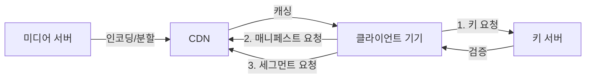
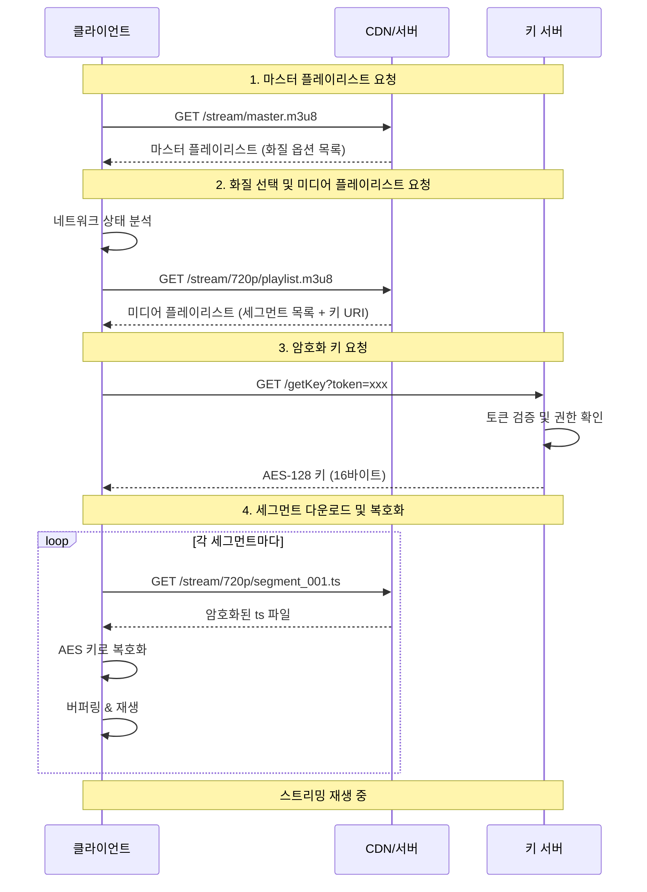

## 들어가는 글

뮤직 스트리밍 서비스를 개발하며 가장 인상 깊었던 기술은 단연 HLS(HTTP Live Streaming)입니다. 처음에는 단순히 "동영상을 재생하는 방법" 정도로 생각했지만, 직접 구현해보니 그 안에는 정교한 보안 메커니즘과 효율적인 전송 철학이 담겨 있었습니다.

이 글은 HLS의 핵심 원리부터 실무에서 마주친 문제 해결 과정까지, 맨땅에 헤딩하며 배웠던 경험을 정리한 것입니다.

<div className="-mx-2 flex flex-wrap overflow-hidden xl:-mx-2">
  <div className="my-1 w-full overflow-hidden px-2 xl:my-1 xl:w-full xl:px-2">
    <Image
      alt="HLS Architecture Flow"
      src="/static/images/hls-streaming-guide/hls-flow.png"
      width={1200}
      height={630}
      className="w-full rounded-lg object-cover"
    />
    <div className="mt-2 text-center text-sm text-gray-500">
      HLS 아키텍처: 미디어 서버에서 클라이언트까지의 전체 흐름
    </div>
  </div>
</div>

<details>
<summary>다이어그램 코드 보기</summary>



</details>

## HLS란 무엇인가?

### 기본 개념

HLS(HTTP Live Streaming)는 2009년 Apple이 개발한 적응형 비트레이트 스트리밍 프로토콜입니다. RFC 8216으로 표준화되었으며, 표준 HTTP 프로토콜을 기반으로 하므로 방화벽이나 프록시 서버를 쉽게 통과할 수 있습니다.

주요 특징:

- HTTP 기반: 기존 웹 인프라와 CDN을 그대로 활용 가능
- 적응형 스트리밍: 네트워크 상태에 따라 화질 자동 조절
- 암호화 지원: AES-128 암호화를 통한 콘텐츠 보호
- 크로스 플랫폼: iOS, Android, 웹 브라우저 등 광범위한 지원

### 왜 HLS인가?

전통적인 파일 다운로드 방식과 비교했을 때 HLS는 명확한 장점이 있습니다.

| 구분          | 전통적 다운로드 방식    | HLS 스트리밍        |
| ------------- | ----------------------- | ------------------- |
| 콘텐츠 접근   | 전체 파일 다운로드 필요 | 조각 단위 순차 요청 |
| 재생 시작     | 다운로드 완료 후        | 즉시 재생 가능      |
| 네트워크 대응 | 불가능                  | 화질 자동 조절      |
| 보안          | 파일 복제 쉬움          | 복제 매우 어려움    |
| 저장 공간     | 전체 파일 용량 필요     | 버퍼 용량만 필요    |

### 누가 사용하는가?

가장 대표적인 예는 <strong>Twitch</strong>입니다. Twitch 방송을 보며 개발자 도구 네트워크 탭을 열어보면 `.ts` 파일이 끊임없이 들어오는 것을 볼 수 있습니다. 이는 HLS가 대규모 라이브 트래픽 처리에 얼마나 효과적인지 보여주는 "살아있는 교과서"입니다.

> <strong>Spotify는?</strong>
> Spotify는 HLS 대신 <strong>독자적인 청크 전송 방식</strong>(암호화된 Ogg/AAC 파일 분할 요청)을
> 사용합니다. 오디오 전용 서비스에 특화된 최적화를 위해 표준 대신 커스텀 방식을 택한 사례입니다.

## m3u8: HLS의 핵심 매니페스트 파일

### m3u8 파일의 역할

m3u8은 HLS에서 가장 중요한 파일입니다. UTF-8로 인코딩된 M3U 재생 목록 파일로, 스트리밍에 필요한 모든 메타데이터를 담고 있습니다.

> <strong>m3u8 = m3u + UTF-8</strong>
> M3U(멀티미디어 재생 목록)의 UTF-8 인코딩 버전을 의미합니다.

### 두 가지 종류의 m3u8

역할에 따라 <strong>두 가지 유형</strong>으로 나뉩니다.

#### 1. 마스터 플레이리스트 (Master Playlist)

재생 가능한 모든 화질 옵션을 나열한 파일입니다. 클라이언트가 가장 먼저 요청하는 파일입니다.

```m3u8
#EXTM3U
#EXT-X-VERSION:4

#EXT-X-STREAM-INF:BANDWIDTH=800000,RESOLUTION=640x360,CODECS="avc1.4d401f,mp4a.40.2"
quality_360p/playlist.m3u8

#EXT-X-STREAM-INF:BANDWIDTH=1400000,RESOLUTION=1280x720,CODECS="avc1.4d401f,mp4a.40.2"
quality_720p/playlist.m3u8

#EXT-X-STREAM-INF:BANDWIDTH=2800000,RESOLUTION=1920x1080,CODECS="avc1.640028,mp4a.40.2"
quality_1080p/playlist.m3u8
```

#### 2. 미디어 플레이리스트 (Media Playlist)

실제 재생할 세그먼트 파일들의 목록입니다. 마스터 플레이리스트에서 특정 화질을 선택하면 해당 미디어 플레이리스트를 요청합니다.

```m3u8
#EXTM3U
#EXT-X-VERSION:4
#EXT-X-TARGETDURATION:10
#EXT-X-MEDIA-SEQUENCE:0
#EXT-X-KEY:METHOD=AES-128,URI="https://key-server.example.com/key?track=audio",IV=0x1234567890ABCDEF

#EXTINF:10.0,
segment_001.ts
#EXTINF:10.0,
segment_002.ts
#EXTINF:10.0,
segment_003.ts

#EXT-X-ENDLIST
```

## 미디어 세그먼트: 잘게 쪼개진 콘텐츠 조각

### 세그먼트 포맷

HLS는 콘텐츠를 잘게 쪼개서 전송합니다. 주로 두 가지 포맷이 사용됩니다.

1.  TS (MPEG-2 Transport Stream): 전통적이며 가장 널리 지원됨.
2.  fMP4 (Fragmented MPEG-4): 최신 코덱 및 저지연 기능에 최적화됨.

### 쪼개서 전송하는 이유

세그먼트는 보통 2~10초 단위로 나뉩니다. 음원 스트리밍은 주로 10초를 사용합니다.

```
원본 파일 (3분 곡)
    ↓ 분할
18개의 ts 세그먼트 (각 10초)
```

이점:

- 빠른 시작: 첫 번째 조각만 받으면 바로 재생 시작.
- 화질 전환: 네트워크 상태에 따라 다음 조각부터 화질 변경 가능.
- 보안: 전체 파일을 한 번에 탈취 불가.
- 효율성: 필요한 만큼만 버퍼링.

## 키서버와 암호화: 콘텐츠 보호의 핵심

### 왜 암호화가 필요한가?

디지털 미디어 콘텐츠는 복제가 쉽습니다. 스트리밍 서비스에서 콘텐츠 보호는 비즈니스의 핵심입니다. HLS는 AES-128 암호화를 통해 이를 해결합니다.

### 키서버 인증 방식

m3u8 파일에 명시된 키서버를 통해 암호화 키를 받아오는 흐름입니다.

```m3u8
#EXT-X-KEY:METHOD=AES-128,URI="https://keyserver.example.com/getKey?token=eyJhbGc...",IV=0x1234567890ABCDEF
```

**전체 재생 및 인증 흐름:**

1.  <strong>마스터/미디어 플레이리스트 요청</strong>: 스트림 정보를 파악하고 네트워크에 맞는 화질
    선택.
2.  <strong>키 요청</strong>: 암호화된 콘텐츠를 풀기 위해 m3u8에 명시된 키서버로 인증 토큰과 함께
    요청.
3.  <strong>검증 및 발급</strong>: 키서버는 토큰을 검증하고, 유효하면 AES-128 키(16바이트)를 반환.
4.  <strong>다운로드 및 복호화</strong>: 클라이언트는 이 키로 암호화된 `.ts` 조각을 실시간으로
    복호화하여 재생.

<details>
<summary>시퀀스 다이어그램 코드 보기</summary>



</details>

### 보안 우위: 다운로드가 원천 불가능한 이유

HLS는 여러 단계의 보호 장치 덕분에 안전합니다.

1.  <strong>조각난 구조</strong>: 파일 하나가 아닌 수십, 수백 개의 조각이라 탈취가 번거로움.
2.  <strong>키 보호</strong>: 인증된 사용자에게만 키 발급, 토큰 검증, 세션 관리 등 추가 보안 적용
    가능.
3.  <strong>시간 제한 토큰</strong>: URL에 유효 시간을 설정하여 링크 공유 방지.

## 클라이언트 구현 및 라이브러리

### 1. 주요 라이브러리 비교

- <strong>hls.js</strong>: 가장 널리 쓰이는 가벼운 라이브러리. HLS 전용이며 커스터마이징이 용이함.
  (Netflix, Twitch 등 사용)
- <strong>Video.js</strong>: 강력한 UI와 플러그인 생태계를 가진 전통의 강자. 내부 엔진으로 hls.js
  사용 가능.
- <strong>Shaka Player</strong>: 구글이 만든 라이브러리로 DASH와 HLS 모두 지원. 오프라인 저장 및
  멀티 DRM 처리에 강점.

일반적인 서비스라면 <strong>hls.js</strong>가 가장 합리적인 선택입니다.

// 2. hls.js 구현 예시 (React)

hls.js는 브라우저 내부에서 <strong>Transmuxing</strong>(TS → MP4 실시간 변환)을 처리하여, 기본적으로 TS 재생을 지원하지 않는 브라우저에서도 재생이 가능하게 합니다.

```tsx
import { useEffect, useRef, useState } from 'react'
import Hls from 'hls.js'

interface HlsPlayerProps {
  src: string
  autoPlay?: boolean
}

export function HlsPlayer({ src, autoPlay = false }: HlsPlayerProps) {
  const videoRef = useRef<HTMLVideoElement>(null)

  useEffect(() => {
    const video = videoRef.current
    if (!video) return

    // 1순위: hls.js 지원 여부 먼저 확인 (Android, PC 등)
    // 중요: 안드로이드 크롬도 canPlayType이 true지만, 기능이 부족한 네이티브 대신 hls.js를 우선 써야 함
    if (Hls.isSupported()) {
      const hls = new Hls({
        enableWorker: true,
        lowLatencyMode: true,
        // 주의: iOS Safari(네이티브)는 이 설정을 무시함.
        // iOS 대응을 위해선 토큰을 헤더가 아닌 '쿼리 스트링'이나 '쿠키'로 넘겨야 함.
        xhrSetup: (xhr, url) => {
          if (url.includes('keyserver')) {
            xhr.setRequestHeader('Authorization', `Bearer ${getToken()}`)
          }
        },
      })

      hls.loadSource(src)
      hls.attachMedia(video)

      hls.on(Hls.Events.MANIFEST_PARSED, () => {
        if (autoPlay) video.play().catch(console.error)
      })

      // 실무 팁: 토큰 만료(401) 시 재발급 및 재시도 로직
      hls.on(Hls.Events.ERROR, async (event, data) => {
        if (data.response?.code === 401) {
          console.warn('토큰 만료 감지. 갱신 로직 실행')
          // 1. 새 토큰 발급: const newToken = await refreshToken()
          // 2. hls 설정 갱신: hls.config.xhrSetup = ...
          // 3. 복구 시도: hls.recoverMediaError()
        }
      })

      return () => hls.destroy()
    }

    // 2순위: hls.js 미지원 시 네이티브 플레이어 사용 (주로 iOS Safari)
    else if (video.canPlayType('application/vnd.apple.mpegurl')) {
      video.src = src
      // iOS는 'Authorization' 헤더 커스텀이 불가능합니다.
      // 따라서 src URL 자체에 ?token=xxx 같이 인증 정보를 포함해야 합니다 (Presigned URL 추천).
    }
  }, [src, autoPlay])

  // playsInline: iOS에서 영상 재생 시 강제로 전체화면이 되는 것을 방지 (커스텀 UI 유지 필수)
  return <video ref={videoRef} controls className="w-full rounded-lg" playsInline />
}
```

## 실무 디버깅 및 트러블슈팅 가이드

HLS 재생 문제가 발생했을 때, 원인이 클라이언트 코드인지 네트워크인지 인코딩된 소스 파일인지 파악하는 단계별 접근법입니다.

### 1. 문제 격리

"내 프론트엔드 코드 문제인가? 스트림 URL 자체 문제인가?"

- <strong>hls.js 데모 페이지 활용</strong>: [hls.js 데모 페이지](https://hls-js.netlify.app/demo/)에
  문제의 m3u8 주소를 넣어봅니다. - <strong>거기서도 안 됨</strong>: 소스(인코딩, CDN, 키서버) 문제 →
  백엔드/미디어 팀 리포트 - <strong>거기선 잘 됨</strong>: 내 프론트엔드 코드(설정, 라이프사이클)
  문제

### 2. 증상별 체크리스트

#### 장시간 재생 시 끊김 (Token Expiry)

- <strong>증상</strong>: 1시간 이상 긴 영상이나 플레이리스트 재생 중 뜬금없이 멈춤.
- <strong>원인</strong>: 초기 로딩 시 받아온 인증 토큰이 만료(Expired)되어, 다음 세그먼트나 키 요청
  시 401 에러 발생.
- <strong>해결</strong>: `hls.on(Hls.Events.ERROR)`에서 `response.code === 401`을 감지하여 토큰을
  갱신(Refresh)하고 재요청하는 로직 필수 구현.

#### 무한 로딩 (Infinite Loading)

- <strong>증상</strong>: 스피너만 돌고 시작 안 됨.
- <strong>체크</strong>: - <strong>CORS</strong>: 개발자 도구 콘솔의 빨간 CORS 에러 확인. m3u8, ts,
  키서버 도메인 모두 허용 필요. - <strong>Mixed Content</strong>: HTTPS 페이지에서 HTTP 스트림 요청
  시 차단됨.

#### 멈춤 (Stalling)

- <strong>증상</strong>: 잘 나오다가 특정 구간에서 멈춤.
- <strong>체크</strong>: - <strong>Gap</strong>: 세그먼트 번호가 중간에 비거나 누락되었는지 확인. -
  <strong>PTS (Presentation Time Stamp)</strong>: 오디오/비디오 싱크가 틀어지면 hls.js가 맞추려다
  멈출 수 있음. - <strong>Discontinuity</strong>: 광고 삽입 등으로 속성이 변할 때
  `#EXT-X-DISCONTINUITY` 태그 유무 확인.

#### PC에선 되는데 iOS에서 안 됨 (가장 흔한 이슈)

- <strong>원인 1: 헤더 인증 불가 (Header Auth Fail)</strong>- <strong>문제</strong>: iOS(Safari)의
  네이티브 플레이어는 개발자가 HTTP 요청 헤더를 조작할 수 없습니다 (`Authorization` 헤더 추가 불가).
  - <strong>해결</strong>: <strong>보안 토큰을 쿼리 파라미터(Query String)이나 쿠키(Cookie)</strong>
  로 넘겨야 합니다. - <strong>추천</strong>: AWS CloudFront Signed URL 같은
  <strong>Presigned URL</strong> 방식을 사용하여 URL 자체에 서명과 만료 시간을 포함시키세요.

- <strong>원인 2: 코덱 및 스펙 불일치</strong>- <strong>증상</strong>: 재생 버튼 눌러도 무반응이거나
  검은 화면. - <strong>체크</strong>: - <strong>Codec Profile</strong>: 구형 iOS는 High Profile
  미지원 가능성 (Main Profile 권장). - <strong>Frame Rate</strong>: 가변 프레임 레이트(VFR)보다 고정
  프레임 레이트(CFR) 권장. - <strong>해결</strong>: Mac의 `mediastreamvalidator` 툴로 스트림 스펙
  위반 검사.

### 3. 키 관리 주의사항 (Key Rotation)

보안을 위해 키를 자주 교체(Rotation)할 경우, 클라이언트가 예전 키를 캐싱하고 있으면 재생 실패가 발생합니다.

- **해결**: 키 요청 API 응답 헤더에 `Cache-Control: no-cache, no-store` 필수 명시.
- **클라이언트**: `xhrSetup`이나 쿼리 파라미터로 캐시 방지 처리.

## 맺음말

HLS를 처음 도입할 때는 단순히 잘게 쪼갠 mp4 파일을 보내는 것이라 생각했습니다. 하지만 깊이 파고들수록 서버, 클라이언트, 보안이 맞물려 돌아가는 거대한 시스템임을 깨달았습니다.

"사용자에게는 끊김 없는 경험을 주면서, 콘텐츠는 안전하게 보호한다"는 모순된 과제를 우아하게 풀어낸 프로토콜이라 생각합니다. 미디어 서비스를 준비 중이라면, 복잡해 보이는 HLS가 결국 가장 든든한 기반이 되어줄 것입니다.
