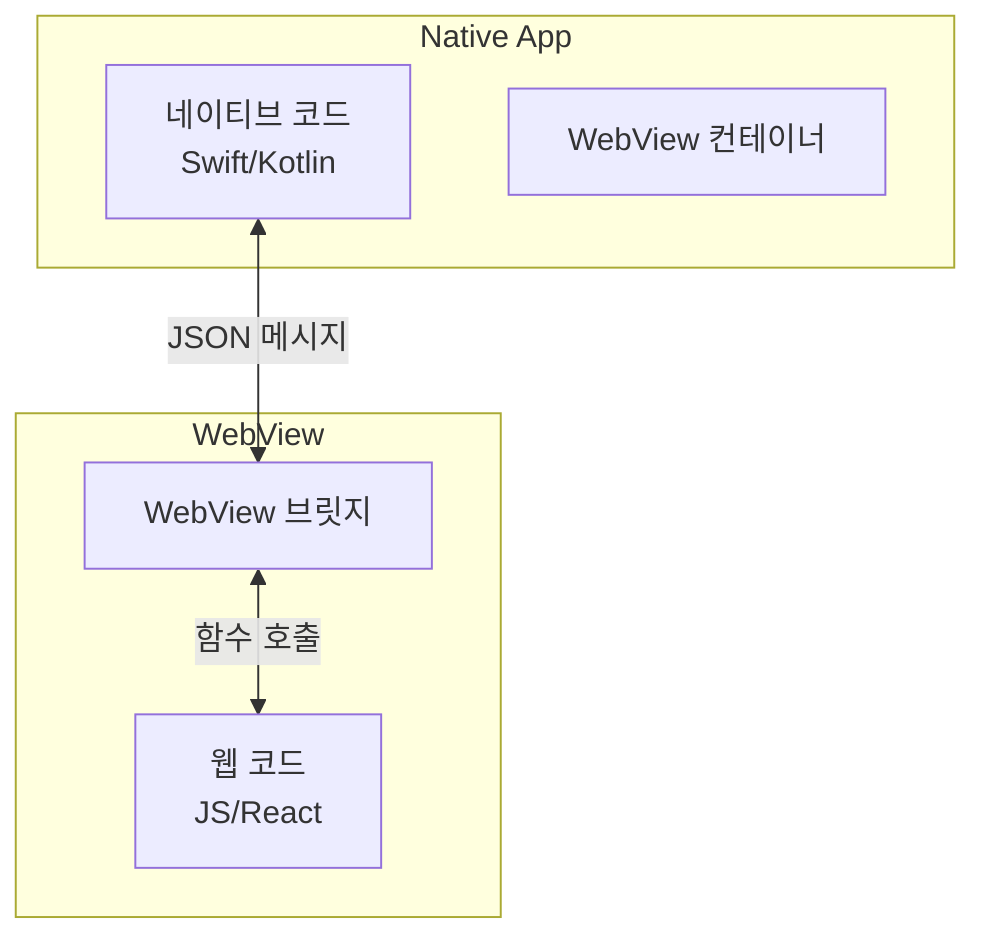
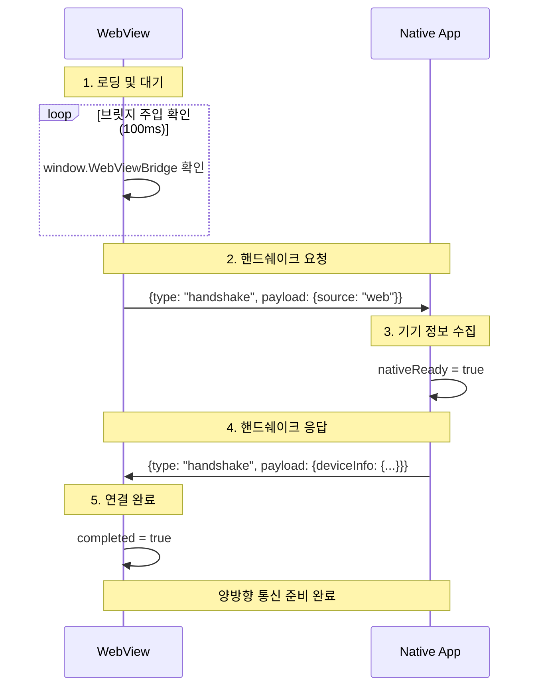

## 들어가는 글

WebView 관련 업무를 처음 맡게 되셨나요? 아마 이런 상황일 겁니다.

- 앱 개발자: "이 화면 WebView로 만들어주실 수 있나요?"
- 기획자: "앱이랑 웹이랑 데이터 주고받아야 해요."
- 나: "WebView가 뭐지? 앱이랑 어떻게 통신하지?"

걱정하지 마세요. 이 글은 WebView를 처음 접하는 분들을 위해 복잡한 용어 없이 핵심 원리부터 실무 팁까지 정리했습니다.

## WebView란 무엇인가?

### 기본 개념

WebView는 네이티브 앱(iOS/Android) 내에 내장된 <strong>"브라우저"</strong>입니다.
일반적으로 사용하는 Chrome이나 Safari 같은 <strong>브라우저</strong>와 달리, <strong>네이티브 앱의 일부처럼 동작</strong>하며 앱 내부에서 웹페이지를 표시합니다.

### 왜 사용하는가?

1.  <strong>빠른 개발 속도</strong>: HTML/CSS/JS로 빠르게 화면 구현 가능. 스토어 심사 없이 웹
    배포만으로 업데이트 반영.
2.  <strong>크로스 플랫폼</strong>: 코드 하나로 iOS와 Android 동시 지원.
3.  <strong>특정 기능 효율성</strong>: 자주 바뀌는 이벤트 페이지나 공지사항, 복잡한 데이터 시각화
    등에 유리.

### 브릿지(Bridge)의 필요성

하지만 WebView 자체만으로는 한계가 있습니다. 카메라, 푸시 알림, 진동 등 네이티브 기능에 직접 접근할 수 없기 때문입니다.
여기서 <strong>"WebView 브릿지"</strong>가 등장합니다. 웹 코드와 네이티브 앱을 연결해주는 다리 역할을 합니다.

<div className="-mx-2 flex flex-wrap overflow-hidden xl:-mx-2">
  <div className="my-1 w-full overflow-hidden px-2 xl:my-1 xl:w-full xl:px-2">
    <Image
      alt="WebView Bridge Architecture"
      src="/static/images/webview-bridge-guide-for-beginners/webview-bridge.png"
      width={1200}
      height={630}
      className="w-full rounded-lg object-cover"
    />
    <div className="mt-2 text-center text-sm text-gray-500">
      WebView 브릿지는 웹 코드와 네이티브 앱을 이어주는 양방향 통신 채널입니다.
    </div>
  </div>
</div>

<details>
<summary>다이어그램 코드 보기</summary>



</details>

## WebView 브릿지 작동 원리

### 양방향 통신

브릿지는 기본적으로 양방향 통신을 지원합니다.

- Web → Native: "사진 찍기 기능 실행해줘!"
- Native → Web: "찰칵! 찍은 사진 URL 줄게."

### 핸드쉐이크 (Handshake): 첫 인사가 중요한 이유

가장 많이 겪는 문제는 **"타이밍 이슈(Race Condition)"**입니다.

> "웹은 준비됐는데 앱이 아직 브릿지를 주입 안 했어요."
> "앱은 준비됐는데 웹이 아직 로딩 중이에요."

웹 페이지 로딩(`window.onload`)이 끝났더라도, 네이티브 앱이 브릿지 객체(`window.WebViewBridge` 등)를 아직 주입하지 못했을 수 있습니다. 이때 바로 호출하면 에러가 납니다.

이를 해결하기 위해 **1) 핸드쉐이크 프로토콜**과 **2) 방어적 코드(Retry/Polling)**가 필수적입니다.

#### 방어적 핸드쉐이크 코드 예시 (Retry Logic)

브릿지 객체가 존재하는지 확인하고, 없다면 **약간의 지연(`setTimeout`) 후 재시도**하는 로직이 필요합니다.

```javascript
let retryCount = 0
const MAX_RETRIES = 50 // 0.1초 * 50 = 5초 대기

const sendHandshake = () => {
  if (window.WebViewBridge) {
    // 1. 브릿지가 있으면 바로 인사
    window.WebViewBridge.postMessage(JSON.stringify({ type: 'handshake' }))
  } else {
    // 2. 없으면 0.1초 뒤에 다시 확인 (Polling)
    if (retryCount >= MAX_RETRIES) {
      console.error('Bridge injection failed: Timeout')
      return // 루프 종료
    }
    retryCount++
    console.log('Bridge not ready, retrying...')
    setTimeout(sendHandshake, 100)
  }
}

window.addEventListener('load', sendHandshake)
```

#### 핸드쉐이크 흐름

1.  **Web**: 로딩 완료 및 브릿지 확인 후 "나 준비됐어!(handshake)" 메시지 발송.
2.  **Native**: 메시지 수신 후 "나도 준비됐어!" 응답 + 기기 정보(OS, 버전 등) 전달.
3.  **Connection**: 서로 확인 완료. 이제부터 본격적인 기능을 호출.

<div className="-mx-2 flex flex-wrap overflow-hidden xl:-mx-2">
  <div className="my-1 w-full overflow-hidden px-2 xl:my-1 xl:w-full xl:px-2">
    <Image
      alt="WebView Handshake Flow"
      src="/static/images/webview-bridge-guide-for-beginners/webview-handshake.png"
      width={1200}
      height={630}
      className="w-full rounded-lg object-cover"
    />
    <div className="mt-2 text-center text-sm text-gray-500">
      핸드쉐이크 과정을 통해 서로 준비가 되었는지 확인합니다. (이 과정에서 웹은 네이티브 브릿지가
      주입될 때까지 짧은 주기로 체크하며 대기합니다.)
    </div>
  </div>
</div>

<details>
<summary>다이어그램 코드 보기</summary>



</details>

## 실무 통신 패턴

### 1. Request-Response 패턴

가장 일반적인 패턴입니다. 웹이 요청하고 네이티브가 응답합니다. `async/await`를 사용하여 비동기 결과를 기다리는 방식으로 구현하는 것이 좋습니다.

하지만 **네이티브 앱이 크래시되거나 로직 오류로 응답을 주지 않을 경우**, 웹의 `await`는 영원히 풀리지 않고 **무한 대기(Hanging)**에 빠질 위험이 있습니다.
이를 방지하기 위해 `Promise.race`를 활용한 **타임아웃 처리**를 권장합니다.

```typescript
// 타임아웃 안전장치 추가 예시
const timeout = new Promise(
  (_, reject) => setTimeout(() => reject(new Error('Timeout')), 3000) // 3초 제한
)

async function openCamera() {
  try {
    // 3초 안에 응답 없으면 에러 발생
    const result = await Promise.race([
      bridge.requestAction({ action: 'camera', params: { mode: 'photo' } }),
      timeout,
    ])
    console.log('사진 URL:', result.imageUrl)
  } catch (error) {
    console.error('카메라 실패 또는 타임아웃:', error)
  }
}
```

### 2. 이벤트 리스너 패턴

GPS 위치 변경이나 푸시 알림 수신처럼, 네이티브에서 발생하는 이벤트를 웹에서 구독하는 방식입니다.

```typescript
useEffect(() => {
  const handler = (payload) => {
    console.log('새 위치:', payload.lat, payload.lng)
  }

  bridge.on('locationChanged', handler)

  // 메모리 누수 방지: 언마운트 시 리스너 제거 필수
  return () => bridge.off('locationChanged', handler)
}, [])
```

## 보안: 타협하면 안 되는 4가지 원칙

WebView는 네이티브 앱의 권한을 빌려 쓰기 때문에 보안 취약점이 될 수 있습니다.

1.  <strong>HTTPS만 사용</strong>: HTTP는 중간자 공격(MITM)에 취약합니다. 무조건 HTTPS를 사용하세요.
2.  <strong>입력값 검증</strong>: 네이티브로 보내는 데이터를 철저히 검증해야 합니다. (XSS 방지 등)
3.  <strong>Allowlist 관리</strong>: 앱 개발자와 협의하여 신뢰할 수 있는 도메인(Allowlist)만 브릿지
    접근을 허용해야 합니다.
4.  <strong>최소 권한 원칙</strong>: 파일 시스템 접근 등 민감한 권한은 꼭 필요한 경우에만
    노출하세요.

## 협업 체크리스트

앱 개발자와의 원활한 협업을 위해 시작 전에 다음 사항들을 꼭 협의하세요.

1.  <strong>기술 스택 결정</strong>: 어떤 브릿지 라이브러리를 쓸지 (`react-native-webview` 등), 지원
    OS 범위 확인.
2.  <strong>API 명세 정의</strong>: 주고받을 액션명, 파라미터 구조, 반환값 타입 정의. (`ts`
    인터페이스 활용 추천)
    <br />※ `window.WebViewBridge`라는 이름은 예시일 뿐이며, 네이티브 개발자가 주입해 주는 객체
    이름(예: `window.Android`, `window.webkit.messageHandlers` 등)과 정확히 일치해야 합니다.
3.  <strong>에러 처리 규칙</strong>: 권한 거부, 네트워크 오류 등을 어떤 에러 코드로 전달할지 정의.
4.  <strong>테스트 환경</strong>: 로컬 서버 접속 허용 여부, 디버그용 APK/IPA 제공 여부.

## 맺음말

WebView 브릿지는 처음엔 복잡해 보이지만, <strong>"JSON 메시지를 주고받는다"</strong>는 핵심만 이해하면 어렵지 않습니다.

- <strong>핸드쉐이크</strong>로 연결을 확인하고,
- <strong>Request-Response</strong> 패턴으로 통신하며,
- <strong>보안</strong>을 철저히 지키면 됩니다.

이 지식은 React Native, Flutter 또는 네이티브 개발을 하더라도 동일하게 적용되는 핵심 원리입니다. 두려워 말고 앱 개발자와 적극적으로 소통하며 개발해보세요!
